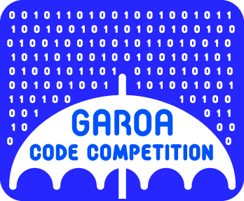

Turing Machine in Python
========================

A simple Turing machine simulator using Python.

This project can be seen as a single implementation with three different
interfaces for using the Turing machines:

- Python API, where this machine can be used both as a Turing a-machine
  (automatic machine) or as a c-machine (choice machine);
- CLI (Command Line Interface), for a-machines; [*TODO*]
- Web UI in Flask, for a-machines.

About the Turing Machine
------------------------

The Turing a-machine (automatic machine) was defined by Alan M. Turing in
his paper "On computable numbers, with an application to the
Entscheidungsproblem" (1936):

http://classes.soe.ucsc.edu/cmps210/Winter11/Papers/turing-1936.pdf

There are several useful books and other sources of information available
about that machine, for example the Wikipedia has a several references about
it:

http://en.wikipedia.org/wiki/Turing_machine

There are some diferences with the way Turing organized the ideas and his
terminology with the one used by some contemporary writers. The names
and expressions within this project tried to be as near as possible to the
ones used in his original paper. That happened as well with the way the
machine rules/instructions are written as an input for the system, trying
to remember the ordering and contents written by Turing himself in that
writing. As an example::

  b None ->  P0  R  c
  c None ->    R    e
  e None ->  P1  R  f
  f None ->    R    b

This is the first example given by Turing in his paper, written in the same
order he wrote::

  m-configuration ; scanned symbol -> behaviour ; final m-configuration

Where the ``m-configuration`` is the name he gives for the internal "state
of mind" of the computer, and the behaviour is a list of tasks to be performed
in order. Later he "normalizes" it into 3 (three) kinds of rules that entails
every other rule, however in this implementation here, the syntax allows
more than such minimalism. For example, his second example, which generates
the same tape as the result, also works in this system::

  b None ->   P0   b
       0 -> R R P1 b
       1 -> R R P0 b

For more information about the maths behind the machine, the reader should
find it on the links above.

Testing
-------

The tests were done on the project core (i.e., the API), in a TDD-like
fashion.

The tests were done with py.test, a requirement for running the tests. The
file ``test_turing.py`` is the one that should be run with py.test::

  ~/pyturing $ py.test test_turing.py
  ======================== test session starts =========================
  platform linux -- Python 3.3.0 -- pytest-2.4.0.dev2
  plugins: cov
  collected 113 items

  test_turing.py .......................................................
  ..........................................................

  ===================== 113 passed in 0.29 seconds =====================

Running with code coverage statistics in Python 2.7.3 (with the``pytest-cov``
package)::

  ~/pyturing $ py.test-2.7 test_turing.py --cov turing
  ======================== test session starts =========================
  platform linux2 -- Python 2.7.3 -- pytest-2.4.0.dev2
  plugins: timeout, xdist, cov
  collected 113 items

  test_turing.py .......................................................
  ..........................................................
  ---------- coverage: platform linux2, python 2.7.3-final-0 -----------
  Name     Stmts   Miss  Cover
  ----------------------------
  turing     149      0   100%

  ===================== 113 passed in 0.26 seconds =====================

As shown above, the core API was tested under Python 3.3.0 and 2.7.3, working
on both successfully with the same code. The tests includes the two examples
said in the "About the Turing Machine" section, although these aren't for
finding something like a "final" m-configuration (indeed, they're endless
examples).

Installing
----------

This is a common Flask project, needing the flask itself for practical use.
Tested with Flask 0.9 (Python 2.7.3) and Flask 0.10.1 (Python 3.3.0). It can
be installed in a virtual environment easily after cloning the project from
GitHub::

  $ virtualenv --distribute --python=python3.3 venv
  $ source venv/bin/activate
  $ pip install flask
  $ python main.py

This is mainly for debugging and evaluation. As a flask project, for deploying
you'll need an IaaS/PaaS that allows WSGI servers (better yet if there's
everything already done for Flask).

As said before, py.test (``pip install pytest``) should be installed for
running the tests. For the code coverage shown above, it also needs the
``pytest-cov`` package.

Turing DSL (Domain Specific Language)
-------------------------------------

The Turing Machine is a machine with rules/instructions, such as::

  q1 0 -> P1 R q2     # Comments starts with the "#" symbol

That says that a machine in the m-configuration ``q1`` and scanning the symbol
``0`` should [P]rint the symbol ``1``, move to the [R]ight and change to the
m-configuration ``q2`` The identifiers are rather arbitrary, the main
symbols are the ``->`` that splits the "before" (configuration) and "after"
(what to be done) timings of the rule, the ``P`` (print), ``E`` (erase), ``R``
(right), ``L`` (left) and ``N`` (no operation), which tells us about the way
the tasks are performed, keeping the way Turing used to express them. The
order matters: ``P1 R`` first prints the symbol ``1``, then moves to the
right, although ``R P1`` first moves to the right then prints ``1``. There's
no need to use exactly two tasks for each rule. Indeed, you don't need any
task at all if you wish, and you can have as well a whole sequence of tasks.

Another words are the ``None`` and the ``Not``, both used by Turing, alowing
rules like::

  q1 Not 3 -> PNone R q2

Although ``E`` is probably way cleaner than ``PNone`` (is it?). The capital
``None`` is the blank symbol itself, and ``Not`` works as a negation of the
symbol that follows. Also, a set of symbols for the scanned symbol
possibilities might be used, like ``[0 1]`` or ``Not [1 2]``, using square
brackets. That obviously don't change the power of the Turing Machine, just
groups some rules together to make a perceived smaller set of instructions to
the programmer.

The absence of a symbol means that "any" symbol is valid. Both this "any"
behavior and the ``Not`` have lower priority in the choice of rules when
there's some indeterminancy. The other criteria is the rule ordering, which
also gives us the first m-configuration (which is the input m-configuration of
the first rule).

Lines starting with at least one whitespace might help as they're considered
something that continues the last line::

  q1   2   -> q2
     Not 3 -> R q1

The second rule above doesn't have the ``q1``, but as it starts after at least
one whitespace in that line, the last m-configuration is implicit. The same
can be organized as a separated line for grouping::

  q1
     0 -> L q3
     1 -> R q4

And for lines starting with whitespaces that happens after and without the
``->`` symbol, the continuation lines is seen as part of the line above it.
This code::

  q1 0 -> L
          P0 R
          P1 R
          P0 L q4

Is the same to this single line rule::

  q1 0 -> L P0 R P1 R P0 L q4

Other details can be seen in the code. Most of these were done to follow
something alike to the the "syntax" Turing used in his paper, trying to keep
the act of programming "for humans" in some (perhaps lazy) sense.

About this project
------------------

Originally made for GCC (Garoa Code Competition), mainly as a way to allow
Turing Machine Coding Dojos to happen, and also to help people understand what
the Turing Machine is, perhaps motivating them to read about the subject,
including the original/historical papers like the one Turing wrote in 1936.

More information about the GCC can be found in this link:

https://garoa.net.br/wiki/GCC_2014

----

License is MIT. See COPYING.txt for more details.

By Danilo J. S. Bellini and Nicolas França